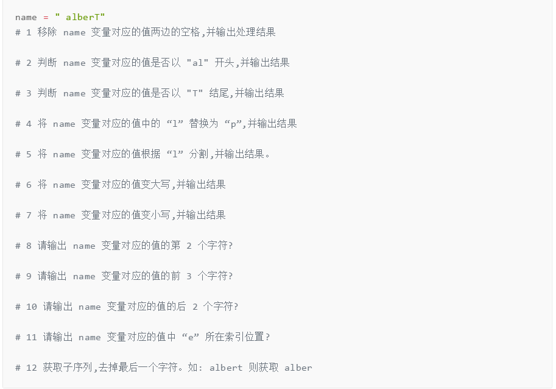
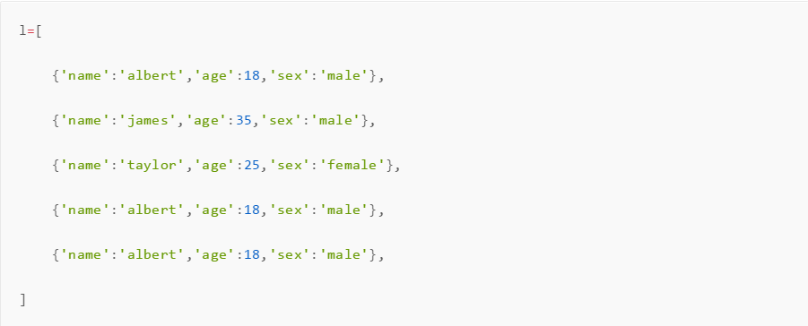
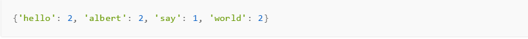
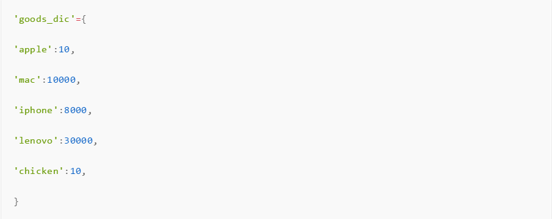

# 练习一
写代码,有如下变量,请按照要求实现每个功能

练习二
有列表data=['albert',18,[2000,1,1]]，分别取出列表中的名字，年龄，出生的年，月，日赋值给不同的变量。

练习三
有如下值集合 [11,22,33,44,55,66,77,88,99,90]，将所有大于 66 的值保存至字典的第一个key中，将小于 66 的值保存至第二个key的值中，即： {'k1': 大于66的所有值, 'k2': 小于66的所有值}

练习四
1.列表l=['a','b',1,'a','a']，列表元素均为可不可变类型，去重得到新列表,且新列表无需保持列表原来的顺序
2.在上题的基础上，保存列表原来的顺序
3.有如下列表，列表元素为可变类型，去重，得到新列表，且新列表一定要保持列表原来的顺序

练习五
使用至少两种方法统计字符串 s='hello albert albert say hello world world'中每个单词的个数，结果如：

练习六
实现简易购物程序,要求如下：首先打印商品详细信息，然后请用户输入商品名和购买个数，则将商品名，价格，购买个数加入购物列表，如果输入为空或其他非法输入则要求用户重新输入

